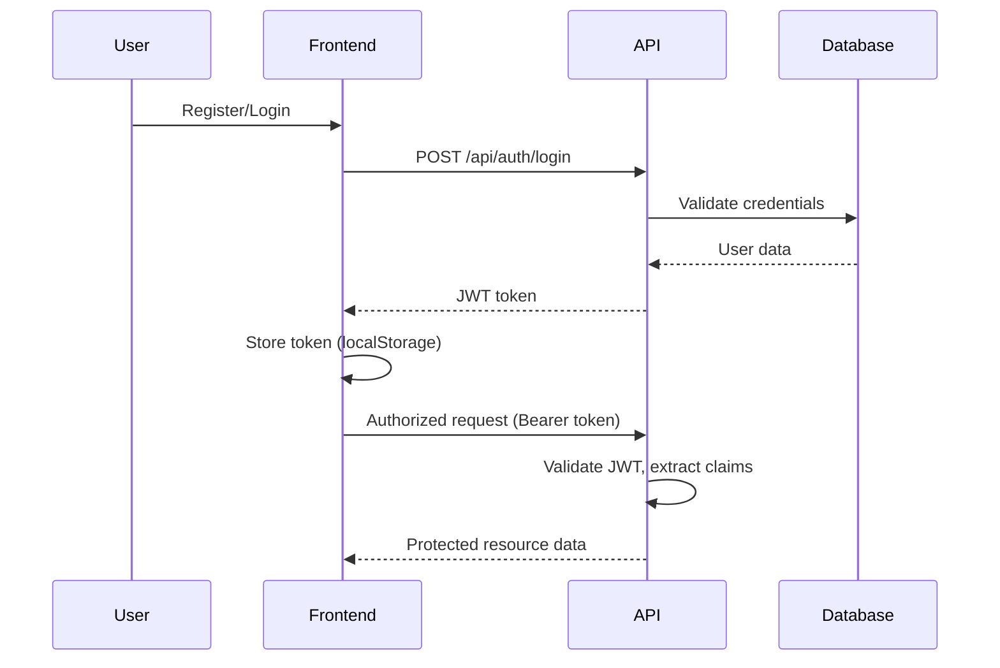

# Imagine Me - Frontend Project Guide

**Project Spirit:** Imagine Me = gamified learning platform. Kids learn through stories, quizzes, mini-games. Parents guide journey. Every interaction rewards progress.

**Live Site:** https://imaginemebylovie.com
**API Base:** https://imaginemebylovie.com
**Environment:** Production (HTTPS enforced, Let's Encrypt SSL)

---

## Vision

Imagine Me creates **safe, engaging learning ecosystem** where:

1. **Children** explore interactive stories, complete quizzes, play mini-games, earn coins
2. **Parents** oversee progress, manage child accounts, approve purchases, celebrate achievements
3. **Learning becomes play** through streaks, daily rewards, personalized avatars

### Core Values

- **Safety First**: Parental oversight on all purchases + account management
- **Celebrate Progress**: Coins, streaks, achievements make learning addictive
- **Content-Rich**: Stories with audio, quizzes, diverse mini-games
- **Fair Economy**: Earn through activity, spend in store, parent approval required

---

## Architecture Overview

```
┌─────────────────────────────────────────────────────────────────┐
│                        Imagine Me Platform                      │
├─────────────────────────────────────────────────────────────────┤
│                                                                   │
│  ┌──────────────┐     ┌──────────────┐     ┌──────────────┐      │
│  │   React/     │     │   React/     │     │   React/     │      │
│  │  Next.js     │     │  Next.js     │     │  Next.js     │      │
│  │  Parent App  │     │  Child App   │     │  Admin App   │      │
│  └──────┬───────┘     └──────┬───────┘     └──────┬───────┘      │
│         │                    │                    │                │
│         └────────────────────┼────────────────────┘                │
│                              │                                     │
│                       ┌──────▼──────┐                              │
│                       │   nginx     │                              │
│                       │  (CORS)     │                              │
│                       └──────┬──────┘                              │
│                              │                                     │
│                    ┌─────────▼──────────┐                          │
│                    │  ASP.NET Core API  │                          │
│                    │  JWT Auth          │                          │
│                    │  .NET 10.0         │                          │
│                    └─────────┬──────────┘                          │
│                              │                                     │
│                    ┌─────────▼──────────┐                          │
│                    │   PostgreSQL       │                          │
│                    │   (JSONB support)  │                          │
│                    └────────────────────┘                          │
│                                                                   │
└─────────────────────────────────────────────────────────────────┘
```

### Technology Stack

| Layer | Technology | Purpose |
|-------|-----------|---------|
| Frontend | React/Next.js, TypeScript | UI for Parent/Child/Admin |
| API | ASP.NET Core (.NET 10.0) | RESTful backend with JWT auth |
| Database | PostgreSQL + JSONB | Relational data + flexible content payloads |
| Reverse Proxy | nginx | CORS, rate limiting, SSL termination |
| Auth | JWT Bearer Tokens | Stateless authentication |

---

## User Roles & Permissions

| Role | Description | Key Capabilities |
|------|-------------|------------------|
| **Parent** | Adults managing child accounts | Create/edit/delete child accounts, view dashboard, approve purchases |
| **Child** | Young learners (under parent oversight) | View stories, take quizzes, play games, earn coins, request purchases |
| **Admin** | Platform administrators | Content CRUD, user management, analytics, system stats |

### Authentication Flow



**Important:**
- Tokens JWT with claims for `role` and `unique_name`
- Tokens expire — handle 401 with re-authentication
- Child login includes daily reward (10 coins) + streak update
- Parents must verify email before first login

---

## Domain Concepts

### Coin Economy

**Earning:**
- Daily login: +10 coins (once/day)
- Stories: Variable based on length
- Quizzes: Based on score
- Mini-games: Based on performance/duration

**Spending:**
- Browse store → Select item → Request purchase → Parent approves → Item received

**Safety:** All purchases require parent approval. Child sees "Pending" until parent action.

### Streak System

- Tracks consecutive daily logins
- Incremented if last login was yesterday
- Resets to 1 if gap > 1 day
- Displayed on child profile + parent dashboard

### Content Status

| Status | Value | Description |
|--------|-------|-------------|
| Draft | 0 | Admins only (editing) |
| Published | 1 | Children (live) |

### Purchase Approval Flow

```
Child requests → Status: Pending
Parent views dashboard → Approve/Reject
Approved → Child receives item
Rejected → Child sees reason
```

---

## TypeScript Type Definitions

```typescript
// ============================================================================
// AUTHENTICATION
// ============================================================================

interface AuthResponse {
  token: string;
  tokenType: "Bearer";
  expiresAt: string;
}

interface ChildAuthResponse extends AuthResponse {
  childId: string;
  username: string;
  coins: number;
  currentStreak: number;
}

// ============================================================================
// ENUMS
// ============================================================================

enum UserType {
  Parent = 1,
  Admin = 2,
  Child = 3
}

enum ContentStatus {
  Draft = 0,
  Published = 1
}

enum PurchaseStatus {
  Pending = 0,
  Approved = 1,
  Rejected = 2
}

enum AudioType {
  BackgroundMusic = 0,
  Narration = 1,
  SoundEffect = 2
}

enum ActivityType {
  Story = 0,
  Quiz = 1,
  Game = 2,
  DailyLogin = 3
}

// ============================================================================
// PARENT DTOs
// ============================================================================

interface ParentDashboardDto {
  totalChildren: number;
  activeChildren: number;
  children: ChildActivitySummaryDto[];
}

interface ChildActivitySummaryDto {
  childId: string;
  username: string;
  coins: number;
  currentStreak: number;
  lastActivityAt: string | null;
}

interface ChildSummaryDto {
  childId: string;
  username: string;
  avatarState: string | null;
  lastActivityAt: string | null;
}

interface ChildDetailDto {
  childId: string;
  username: string;
  parentId: string;
  avatarState: string | null;
  coins: number;
  currentStreak: number;
  createdAt: string;
  lastLoginAt: string | null;
}

interface ChildActivityDto {
  activityId: string;
  childId: string;
  activityType: ActivityType;
  storyId: string | null;
  quizId: string | null;
  coinsEarned: number;
  completedAt: string;
  metadata: string | null;
}

// ============================================================================
// CHILD DTOs
// ============================================================================

interface ChildProfileDto {
  childId: string;
  username: string;
  parentId: string;
  avatarState: string | null;
  coins: number;
  currentStreak: number;
  lastLoginAt: string | null;
}

interface ChildStatsDto {
  storiesRead: number;
  quizzesTaken: number;
  gamesPlayed: number;
  totalCoinsEarned: number;
  totalCoinsSpent: number;
  currentStreak: number;
}

interface DailyRewardResultDto {
  coinsAwarded: number;
  currentStreak: number;
  message: string;
}

interface StoryDto {
  id: string;
  title: string;
  coverImageUrl: string;
  contentPayload: string;
  status: ContentStatus;
  createdAt: string;
  updatedAt: string | null;
}

interface QuizDto {
  id: string;
  storyId: string | null;
  title: string;
  questions: QuestionDto[];
  status: ContentStatus;
  createdAt: string;
  updatedAt: string | null;
}

interface QuestionDto {
  questionText: string;
  options: string[];
  correctAnswer: number;
}

interface ActivityLoggedDto {
  activityId: string;
  coinsEarned: number;
  message: string;
}

interface StoreItemDto {
  id: string;
  name: string;
  priceInCoins: number;
  assetUrl: string;
  metadata: string | null;
  createdAt: string;
  updatedAt: string | null;
}

interface PurchaseDto {
  id: string;
  childId: string;
  childUsername: string;
  storeItemId: string;
  storeItemName: string;
  storeItemAssetUrl: string;
  priceInCoins: number;
  status: PurchaseStatus;
  requestedAt: string;
  completedAt: string | null;
  rejectionReason: string | null;
}

interface MiniGameContentDto {
  id: string;
  title: string;
  gameType: string;
  description: string;
  status: ContentStatus;
  thumbnailUrl: string;
  createdAt: string;
}

interface MiniGameContentDetailDto {
  id: string;
  title: string;
  gameType: string;
  description: string;
  thumbnailUrl: string;
  gamePayload: string;
  assets: string;
  status: ContentStatus;
  createdAt: string;
  updatedAt: string | null;
}

// ============================================================================
// ADMIN DTOs
// ============================================================================

interface PaginatedUsersDto<T = UserDto> {
  users: T[];
  total: number;
  page: number;
  pageSize: number;
}

interface UserDto {
  id: string;
  email: string;
  fullName: string;
  userType: UserType;
  disabled: boolean;
  createdAt: string;
}

interface UserStatsDto {
  totalUsers: number;
  totalParents: number;
  totalChildren: number;
  totalAdmins: number;
}

interface StoryAudioDto {
  id: string;
  storyId: string;
  audioUrl: string;
  mimeType: string;
  type: AudioType;
  startTime: number | null;
  endTime: number | null;
  language: string;
  durationSeconds: number;
}

// ============================================================================
// ERROR RESPONSE
// ============================================================================

interface ErrorResponse {
  status: number;
  message: string;
  details?: string;
}
```

---

## Frontend Patterns

### API Client Setup (TypeScript)

```typescript
// lib/apiClient.ts

const API_BASE_URL = process.env.NEXT_PUBLIC_API_URL ?? 'https://imaginemebylovie.com';

class ApiClient {
  private baseURL: string;

  constructor(baseURL: string) {
    this.baseURL = baseURL;
  }

  private getHeaders(): HeadersInit {
    const token = this.getToken();
    return {
      'Content-Type': 'application/json',
      ...(token && { 'Authorization': `Bearer ${token}` })
    };
  }

  private getToken(): string | null {
    if (typeof window === 'undefined') return null;
    return localStorage.getItem('token');
  }

  private setToken(token: string): void {
    if (typeof window !== 'undefined') {
      localStorage.setItem('token', token);
    }
  }

  private clearToken(): void {
    if (typeof window !== 'undefined') {
      localStorage.removeItem('token');
    }
  }

  async get<T>(endpoint: string): Promise<T> {
    const response = await fetch(`${this.baseURL}${endpoint}`, {
      headers: this.getHeaders()
    });

    if (!response.ok) {
      throw await this.handleError(response);
    }

    return response.json();
  }

  async post<T>(endpoint: string, data: unknown): Promise<T> {
    const response = await fetch(`${this.baseURL}${endpoint}`, {
      method: 'POST',
      headers: this.getHeaders(),
      body: JSON.stringify(data)
    });

    if (!response.ok) {
      throw await this.handleError(response);
    }

    return response.json();
  }

  async put<T>(endpoint: string, data: unknown): Promise<T> {
    const response = await fetch(`${this.baseURL}${endpoint}`, {
      method: 'PUT',
      headers: this.getHeaders(),
      body: JSON.stringify(data)
    });

    if (!response.ok) {
      throw await this.handleError(response);
    }

    return response.json();
  }

  async delete(endpoint: string): Promise<void> {
    const response = await fetch(`${this.baseURL}${endpoint}`, {
      method: 'DELETE',
      headers: this.getHeaders()
    });

    if (!response.ok) {
      throw await this.handleError(response);
    }
  }

  private async handleError(response: Response): Promise<Error> {
    if (response.status === 401) {
      this.clearToken();
      if (typeof window !== 'undefined') {
        window.location.href = '/login';
      }
    }

    const error: ErrorResponse = await response.json();
    return new Error(error.message || 'Request failed');
  }

  setAuthToken(token: string): void {
    this.setToken(token);
  }

  logout(): void {
    this.clearToken();
  }
}

export const apiClient = new ApiClient(API_BASE_URL);
```

### React Context for Authentication

```typescript
// contexts/AuthContext.tsx

import { createContext, useContext, useState, useEffect, ReactNode } from 'react';
import { apiClient } from '@/lib/apiClient';

interface AuthUser {
  id: string;
  email: string;
  fullName: string;
  role: UserType;
}

interface AuthContextValue {
  user: AuthUser | null;
  token: string | null;
  login: (email: string, password: string, isChild?: boolean) => Promise<void>;
  childLogin: (username: string, password: string) => Promise<ChildAuthResponse>;
  logout: () => void;
  isAuthenticated: boolean;
  isLoading: boolean;
}

const AuthContext = createContext<AuthContextValue | null>(null);

export function AuthProvider({ children }: { children: ReactNode }) {
  const [user, setUser] = useState<AuthUser | null>(null);
  const [token, setToken] = useState<string | null>(null);
  const [isLoading, setIsLoading] = useState(true);

  useEffect(() => {
    const storedToken = localStorage.getItem('token');
    const storedUser = localStorage.getItem('user');

    if (storedToken && storedUser) {
      setToken(storedToken);
      setUser(JSON.parse(storedUser));
    }
    setIsLoading(false);
  }, []);

  const login = async (email: string, password: string, isChild = false) => {
    const endpoint = isChild ? '/api/auth/child/login' : '/api/auth/login';
    const data: AuthResponse = await apiClient.post(endpoint, { email, password });

    setToken(data.token);
    apiClient.setAuthToken(data.token);

    const authUser: AuthUser = {
      id: 'decoded-from-jwt',
      email,
      fullName: email,
      role: isChild ? UserType.Child : UserType.Parent
    };

    setUser(authUser);
    localStorage.setItem('token', data.token);
    localStorage.setItem('user', JSON.stringify(authUser));
  };

  const childLogin = async (username: string, password: string) => {
    const data: ChildAuthResponse = await apiClient.post('/api/auth/child/login', {
      username,
      password
    });

    setToken(data.token);
    apiClient.setAuthToken(data.token);

    const authUser: AuthUser = {
      id: data.childId,
      email: username,
      fullName: data.username,
      role: UserType.Child
    };

    setUser(authUser);
    localStorage.setItem('token', data.token);
    localStorage.setItem('user', JSON.stringify(authUser));

    return data;
  };

  const logout = () => {
    setToken(null);
    setUser(null);
    apiClient.logout();
    localStorage.removeItem('token');
    localStorage.removeItem('user');
  };

  return (
    <AuthContext.Provider
      value={{
        user,
        token,
        login,
        childLogin,
        logout,
        isAuthenticated: !!token,
        isLoading
      }}
    >
      {children}
    </AuthContext.Provider>
  );
}

export function useAuth() {
  const context = useContext(AuthContext);
  if (!context) {
    throw new Error('useAuth must be used within AuthProvider');
  }
  return context;
}
```

### Custom Hook Pattern

```typescript
// hooks/useChildProfile.ts

import { useState, useEffect } from 'react';
import { useAuth } from '@/contexts/AuthContext';
import { apiClient } from '@/lib/apiClient';
import { ChildProfileDto } from '@/types';

export function useChildProfile() {
  const { isAuthenticated } = useAuth();
  const [profile, setProfile] = useState<ChildProfileDto | null>(null);
  const [isLoading, setIsLoading] = useState(true);
  const [error, setError] = useState<Error | null>(null);

  useEffect(() => {
    if (!isAuthenticated) {
      setIsLoading(false);
      return;
    }

    const fetchProfile = async () => {
      try {
        setIsLoading(true);
        const data = await apiClient.get<ChildProfileDto>('/api/child/profile');
        setProfile(data);
      } catch (err) {
        setError(err instanceof Error ? err : new Error('Failed to fetch profile'));
      } finally {
        setIsLoading(false);
      }
    };

    fetchProfile();
  }, [isAuthenticated]);

  return { profile, isLoading, error };
}
```

### Next.js Server Actions Pattern

```typescript
// app/actions/children.ts

'use server';

import { apiClient } from '@/lib/apiClient';

export async function createChildAction(formData: FormData) {
  const username = formData.get('username') as string;
  const password = formData.get('password') as string;

  try {
    const childId = await apiClient.post<string>('/api/parent/children', {
      username,
      password
    });

    return { success: true, childId };
  } catch (error) {
    return {
      success: false,
      error: error instanceof Error ? error.message : 'Failed to create child'
    };
  }
}
```

---

## State Management Recommendations

### For Small Apps: React Context + Hooks

```
AuthProvider → User authentication state
CoinProvider → Coin balance, transaction history
ContentProvider → Stories, quizzes, mini-games cache
```

### For Medium/Large Apps: Zustand or Redux Toolkit

```typescript
// stores/useChildStore.ts (Zustand example)

import { create } from 'zustand';
import { ChildProfileDto, ChildStatsDto } from '@/types';

interface ChildStore {
  profile: ChildProfileDto | null;
  stats: ChildStatsDto | null;
  setProfile: (profile: ChildProfileDto) => void;
  setStats: (stats: ChildStatsDto) => void;
  updateCoins: (amount: number) => void;
}

export const useChildStore = create<ChildStore>((set) => ({
  profile: null,
  stats: null,
  setProfile: (profile) => set({ profile }),
  setStats: (stats) => set({ stats }),
  updateCoins: (amount) => set((state) => ({
    profile: state.profile
      ? { ...state.profile, coins: state.profile.coins + amount }
      : null
  }))
}));
```

---

## Component Structure Recommendations

```
src/
├── app/                    # Next.js app router
│   ├── (auth)/            # Auth group: login, register
│   ├── parent/            # Parent dashboard
│   ├── child/             # Child app
│   └── admin/             # Admin panel
├── components/
│   ├── auth/              # Login, register forms
│   ├── parent/            # Parent-specific components
│   ├── child/             # Child-specific components
│   ├── admin/             # Admin-specific components
│   └── ui/                # Reusable UI components
├── contexts/              # React contexts
├── hooks/                 # Custom hooks
├── lib/                   # Utilities (apiClient, helpers)
├── stores/                # State stores (Zustand/Redux)
├── types/                 # TypeScript definitions
└── styles/                # Global styles, Tailwind config
```

---

## Security Best Practices

1. **Token Storage**: `localStorage` (acceptable for this app size). For production, consider `httpOnly` cookies with Next.js API route proxy.

2. **Token Expiry**: Handle 401 gracefully:
   ```typescript
   if (response.status === 401) {
     logout();
     router.push('/login');
   }
   ```

3. **Rate Limits**: API enforces 10 req/sec (5 req/sec for auth). Client-side throttling:
   ```typescript
   import { pLimit } from 'p-limit';
   const limit = pLimit(8);
   ```

4. **CORS**: Already configured on nginx.

5. **HTTPS Only**: Production enforces via nginx redirect.

---

## Development Environment

```bash
# .env.local
NEXT_PUBLIC_API_URL=http://localhost:5200
```

For local dev with hot reload:
- Backend: `dotnet run --project src/ImagineMe.API` (http://localhost:5200)
- Frontend: `npm run dev` (http://localhost:3000)

---

## Key Workflows

### Parent Creates Child Account
```
Parent login → Dashboard → "Add Child" →
Enter username/password → API creates child →
Child can now login
```

### Child Learning Journey
```
Child login → Claims daily reward (+10 coins) →
Views stories → Selects story → Reads →
Logs activity → Takes quiz → Logs quiz →
Views store → Requests purchase → Pending →
Parent approves → Child receives item
```

### Admin Publishes Content
```
Admin login → Create story (Draft) →
Add quiz → Link to story →
Publish story →
Child can now access
```

---

## Performance Considerations

1. **Image Optimization**: Use Next.js `Image` component:
   ```typescript
   <Image
     src={story.coverImageUrl}
     alt={story.title}
     width={400}
     height={300}
   />
   ```

2. **Content Caching**: Cache static content in React state or Zustand.

3. **Polling vs Real-time**: REST only. For purchase status updates, poll every 10-15 seconds.

4. **Lazy Loading**: For large lists, implement virtual scrolling (react-virtuoso).

---

## Testing Considerations

```typescript
// Mock API client for tests
// vitest.config.ts:
alias: {
  '@lib/apiClient': '@lib/__mocks__/apiClient'
}

// Example test
describe('useChildProfile', () => {
  it('fetches and returns child profile', async () => {
    const mockProfile: ChildProfileDto = {
      childId: '123',
      username: 'testchild',
      // ... other fields
    };

    (apiClient.get as vi.Mock).mockResolvedValue(mockProfile);

    const { result } = renderHook(() => useChildProfile());
    
    await waitFor(() => expect(result.current.profile).toEqual(mockProfile));
  });
});
```

---

## Deployment Notes

1. **Environment Variables**:
   ```bash
   NEXT_PUBLIC_API_URL=https://imaginemebylovie.com
   ```

2. **Build Output**:
   ```bash
   npm run build        # Next.js production build
   npm run start        # Start production server
   ```

3. **Static Export**: If using `output: 'export'`, app becomes fully static but loses API routes and server-side features. Not recommended for this app due to authentication.

---

## Accessibility Guidelines

- **Child-Friendly UI**: Large buttons, clear icons, simple navigation
- **Parent Dashboard**: Data tables with clear headers, filter options
- **Keyboard Navigation**: Ensure all interactive elements accessible
- **Screen Reader**: Semantic HTML, ARIA labels
- **Color Contrast**: WCAG AA minimum (4.5:1 for text)

---

## Reference Links

- **API Documentation**: `/API-DOCUMENTATION.md`
- **Swagger UI**: https://imaginemebylovie.com/swagger/index.html
- **Health Check**: https://imaginemebylovie.com/health

---

**Last Updated:** 2026-08-17
